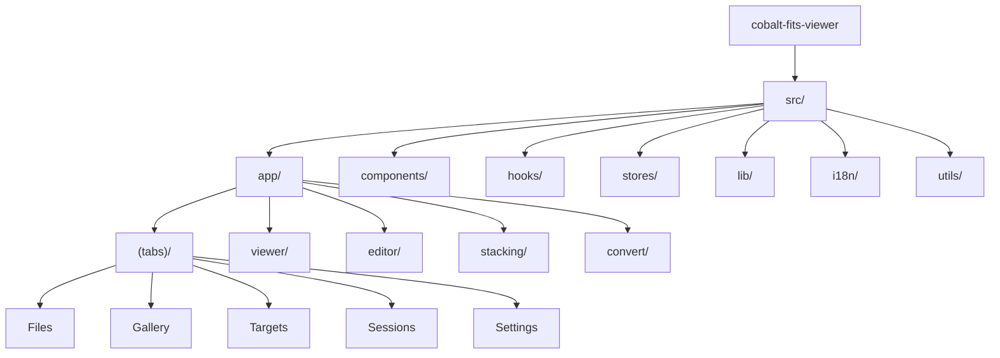

# Cobalt FITS Viewer

> AI-friendly project documentation - Last updated: 2026-02-14

## Project Vision

A cross-platform FITS file viewer and astronomical image processor for astronomers. View, analyze, stack, and convert FITS images on iOS, Android, and Web. Built with React Native + Expo.

## Architecture Overview

This is a React Native application built with Expo SDK 54, featuring:

- **File-based routing** via Expo Router 6
- **FITS file parsing** via fitsjs-ng with pako decompression
- **GPU rendering** via @shopify/react-native-skia for FITS image display
- **State management** via Zustand (9 stores)
- **Component library** via HeroUI Native
- **Styling** via Uniwind + TailwindCSS 4 with dark mode support
- **Animations** via React Native Reanimated
- **Internationalization** via i18n-js with auto-detection
- **Location & Calendar** via expo-location, expo-maps, expo-calendar
- **Type safety** via TypeScript strict mode

## Module Structure



## Module Index

| Path                                | Type      | Description                                                       |
| ----------------------------------- | --------- | ----------------------------------------------------------------- |
| [src/app](./src/app/CLAUDE.md)      | Routing   | File-based routing, 5 tabs + detail screens (viewer, editor, etc) |
| [src/components](./src/components/) | UI        | Reusable components (common, fits, gallery, targets, sessions)    |
| [src/hooks](./src/hooks/)           | Hooks     | 21 custom hooks (FITS, gallery, stacking, location, etc)          |
| [src/stores](./src/stores/)         | State     | 9 Zustand stores (fits, gallery, viewer, settings, etc)           |
| [src/lib](./src/lib/)               | Logic     | Core business logic (FITS parsing, stacking, converter, etc)      |
| [src/i18n](./src/i18n/CLAUDE.md)    | i18n      | Internationalization with i18n-js, supports en/zh locales         |
| [src/utils](./src/utils/)           | Utilities | Utility functions including className helper                      |

## Run & Develop

### Prerequisites

- Node.js 20+
- pnpm (recommended)

### Commands

```bash
# Install dependencies
pnpm install

# Start development server
pnpm start

# Platform-specific
pnpm ios       # iOS simulator
pnpm android   # Android emulator
pnpm web       # Web browser

# Quality checks
pnpm lint          # ESLint
pnpm lint:fix      # ESLint with auto-fix
pnpm format        # Prettier format
pnpm format:check  # Prettier check
pnpm typecheck     # TypeScript check
```

### Project Structure

```
src/
|-- app/                  # File-based routes (Expo Router)
|   |-- _layout.tsx       # Root layout (Providers)
|   |-- index.tsx         # Entry redirect
|   |-- [...missing].tsx  # 404 page
|   |-- (tabs)/           # Tab navigation (5 tabs)
|   |   |-- index.tsx     # Files tab (FITS file manager)
|   |   |-- gallery.tsx   # Gallery tab (image browser)
|   |   |-- targets.tsx   # Targets tab (observation targets)
|   |   |-- sessions.tsx  # Sessions tab (observation log)
|   |   `-- settings.tsx  # Settings tab
|   |-- viewer/           # FITS image viewer
|   |-- header/           # FITS header inspector
|   |-- editor/           # Image editor
|   |-- stacking/         # Image stacking
|   |-- compose/          # RGB compose
|   |-- convert/          # Format converter
|   |-- album/            # Album detail
|   |-- target/           # Target detail
|   |-- session/          # Session detail
|   `-- map/              # Map view
|-- components/           # Reusable UI components
|   |-- common/           # Shared (EmptyState, LoadingOverlay, etc)
|   |-- fits/             # FITS components (viewer, histogram, etc)
|   |-- gallery/          # Gallery components
|   |-- targets/          # Target components
|   |-- sessions/         # Session components
|   `-- converter/        # Converter components
|-- hooks/                # 21 custom React hooks
|-- stores/               # 9 Zustand state stores
|-- lib/                  # Core business logic
|   |-- fits/             # FITS file parsing
|   |-- stacking/         # Image stacking algorithms
|   |-- converter/        # Format conversion
|   |-- gallery/          # Gallery logic
|   |-- targets/          # Target management
|   |-- sessions/         # Session management
|   |-- calendar/         # Calendar integration
|   |-- logger/           # Logging system
|   |-- backup/           # Backup & restore
|   |-- theme/            # Theme configuration
|   `-- utils/            # Utility functions
|-- i18n/                 # Internationalization (en, zh)
|-- utils/                # General utilities
|-- global.css            # TailwindCSS + Uniwind + HeroUI styles
`-- uniwind-types.d.ts    # Uniwind theme types
```

## Test Strategy

| Type        | Status         | Tools                               |
| ----------- | -------------- | ----------------------------------- |
| Unit        | Configured     | Jest + React Native Testing Library |
| Integration | Not configured | -                                   |
| E2E         | Not configured | -                                   |

## Coding Standards

### TypeScript

- Strict mode enabled (`strict: true`)
- No explicit `any` (warning)
- Unused vars prefixed with `_` are ignored

### Code Style (Prettier)

```json
{
  "semi": true,
  "singleQuote": false,
  "tabWidth": 2,
  "trailingComma": "all",
  "printWidth": 100,
  "endOfLine": "lf"
}
```

### Linting (ESLint)

- TypeScript ESLint recommended rules
- React Hooks rules enforced
- Prettier integration (no conflicting rules)

### EditorConfig

- UTF-8 encoding
- LF line endings
- 2-space indentation
- Final newline inserted

## Git Workflow

### Commit Convention (Conventional Commits)

Types: `feat`, `fix`, `docs`, `style`, `refactor`, `perf`, `test`, `build`, `ci`, `chore`, `revert`

Example: `feat: add sigma clipping stacking algorithm`

### Pre-commit Hooks (Husky + lint-staged)

- **pre-commit**: Runs ESLint fix + Prettier on staged `.ts/.tsx` files
- **commit-msg**: Validates commit message format via commitlint

### CI Pipeline (.github/workflows/ci.yml)

Triggers on push/PR to `master` branch:

1. **Type Check**: `pnpm typecheck`
2. **Lint & Format**: `pnpm lint` + `pnpm format:check`
3. **Test**: `pnpm jest --ci --coverage`
4. **Build (Web)**: `pnpm exec expo export --platform web`

## AI Usage Guidelines

### When modifying this project

1. **Routing**: Add new screens in `src/app/` following Expo Router conventions
2. **Styling**: Use Uniwind classes via `className` prop, reference HeroUI Native components
3. **i18n**: Add translations to both `en.ts` and `zh.ts`, use `useI18n()` hook
4. **State**: Use Zustand stores in `src/stores/`, follow existing patterns
5. **Business logic**: Place in `src/lib/` with clear module boundaries
6. **Types**: Keep types co-located in `src/lib/*/types.ts`

### Common tasks

- **Add new screen**: Create file in `src/app/` with appropriate route pattern
- **Add new tab**: Add file in `src/app/(tabs)/` and update `_layout.tsx`
- **Add translation**: Add key to locale files, use `t("key.path")` in components
- **Add new store**: Create Zustand store in `src/stores/`
- **Add FITS feature**: Add logic in `src/lib/fits/`, hook in `src/hooks/`, UI in `src/components/fits/`

### Dependencies overview

| Category       | Key Packages                                                            |
| -------------- | ----------------------------------------------------------------------- |
| Navigation     | `expo-router`, `react-native-screens`, `react-native-safe-area-context` |
| UI             | `heroui-native`, `@expo/vector-icons`, `@gorhom/bottom-sheet`           |
| Styling        | `tailwindcss`, `uniwind`, `tailwind-merge`, `tailwind-variants`         |
| Rendering      | `@shopify/react-native-skia`, `react-native-svg`                        |
| Animation      | `react-native-reanimated`, `react-native-gesture-handler`               |
| State          | `zustand`                                                               |
| FITS           | `fitsjs-ng`, `pako`                                                     |
| Storage        | `@react-native-async-storage/async-storage`, `expo-secure-store`        |
| Location & Map | `expo-location`, `expo-maps`                                            |
| Calendar       | `expo-calendar`                                                         |
| i18n           | `i18n-js`, `expo-localization`                                          |
| Tooling        | `typescript`, `eslint`, `prettier`, `husky`, `commitlint`               |

## Changelog

| Date       | Version | Changes                                                                                       |
| ---------- | ------- | --------------------------------------------------------------------------------------------- |
| 2025-02-14 | 1.0.0   | Initial project setup with Expo SDK 54, Expo Router 6, HeroUI Native, TailwindCSS 4 + Uniwind |
| 2026-02-14 | -       | FITS viewer, gallery, targets, sessions, stacking, converter, editor features                 |
| 2026-02-14 | -       | AI context documentation updated for Cobalt FITS Viewer                                       |
