# Cobalt FITS Viewer

> AI-friendly project documentation - Last updated: 2026-02-15

## Project Vision

A cross-platform FITS file viewer and astronomical image processor for astronomers. View, analyze, stack, and convert FITS images on iOS, Android, and Web. Built with React Native + Expo SDK 54.

## Architecture Overview

This is a React Native application built with Expo SDK 54, featuring:

- **File-based routing** via Expo Router 6
- **FITS file parsing** via fitsjs-ng with pako decompression
- **GPU rendering** via @shopify/react-native-skia for FITS image display
- **State management** via Zustand (10 stores with MMKV persistence)
- **Component library** via HeroUI Native
- **Styling** via Uniwind + TailwindCSS 4 with dark mode support
- **Animations** via React Native Reanimated
- **Internationalization** via i18n-js with auto-detection (en/zh)
- **Location & Calendar** via expo-location, expo-maps, expo-calendar
- **Type safety** via TypeScript strict mode

## Module Structure

```mermaid
graph TD
    subgraph Root["cobalt-fits-viewer"]
        A["src/"]
    end

    subgraph App["app/ (Routing)"]
        A --> B["app/"]
        B --> B1["_layout.tsx<br/>Root Layout"]
        B --> B2["index.tsx<br/>Entry Redirect"]
        B --> B3["(tabs)/"]
        B --> B4["viewer/"]
        B --> B5["editor/"]
        B --> B6["stacking/"]
        B --> B7["convert/"]
        B --> B8["compose/"]
        B --> B9["header/"]
        B --> B10["album/"]
        B --> B11["target/"]
        B --> B12["session/"]
        B --> B13["map/"]
        B --> B14["backup/"]
        B --> B15["astrometry/"]
        B --> B16["compare/"]
        B3 --> T1["Files Tab"]
        B3 --> T2["Gallery Tab"]
        B3 --> T3["Targets Tab"]
        B3 --> T4["Sessions Tab"]
        B3 --> T5["Settings Tab"]
    end

    subgraph Components["components/ (UI)"]
        A --> C["components/"]
        C --> C1["common/"]
        C --> C2["fits/"]
        C --> C3["gallery/"]
        C --> C4["targets/"]
        C --> C5["sessions/"]
        C --> C6["converter/"]
        C --> C7["backup/"]
        C --> C8["astrometry/"]
        C --> C9["map/"]
        C --> C10["settings/"]
    end

    subgraph Core["Core Modules"]
        A --> D["hooks/ (29 hooks)"]
        A --> E["stores/ (10 stores)"]
        A --> F["lib/ (Business Logic)"]
        A --> G["i18n/ (Translations)"]
        A --> H["utils/ (Utilities)"]
    end

    subgraph LibModules["lib/ Submodules"]
        F --> F1["fits/"]
        F --> F2["stacking/"]
        F --> F3["gallery/"]
        F --> F4["targets/"]
        F --> F5["sessions/"]
        F --> F6["converter/"]
        F --> F7["backup/"]
        F --> F8["astrometry/"]
        F --> F9["calendar/"]
        F --> F10["logger/"]
        F --> F11["map/"]
        F --> F12["theme/"]
        F --> F13["utils/"]
    end

    click B "./src/app/CLAUDE.md" "View app module docs"
    click G "./src/i18n/CLAUDE.md" "View i18n module docs"
    click F1 "./src/lib/fits/CLAUDE.md" "View FITS module docs"
    click F8 "./src/lib/astrometry/CLAUDE.md" "View astrometry module docs"
```



## Module Index

| Path                                        | Type      | Description                                                    | Entry/Key Files                               |
| ------------------------------------------- | --------- | -------------------------------------------------------------- | --------------------------------------------- |
| [src/app](./src/app/CLAUDE.md)              | Routing   | File-based routing, 5 tabs + detail screens                    | `_layout.tsx`, `(tabs)/_layout.tsx`           |
| [src/components](./src/components/)         | UI        | Reusable components (common, fits, gallery, targets, sessions) | 10 subdirectories, 65+ components             |
| [src/hooks](./src/hooks/)                   | Hooks     | 29 custom hooks (FITS, gallery, stacking, location, etc)       | `useFitsFile.ts`, `useGallery.ts`             |
| [src/stores](./src/stores/)                 | State     | 10 Zustand stores with MMKV persistence                        | `useFitsStore.ts`, `useTargetStore.ts`        |
| [src/lib/fits](./src/lib/fits/)             | Logic     | FITS file parsing, metadata extraction, header manipulation    | `parser.ts`, `types.ts`, `headerWriter.ts`    |
| [src/lib/stacking](./src/lib/stacking/)     | Logic     | Image stacking (alignment, calibration, star detection)        | `alignment.ts`, `calibration.ts`              |
| [src/lib/gallery](./src/lib/gallery/)       | Logic     | Gallery logic (albums, thumbnails, duplicates, classification) | `albumManager.ts`, `frameClassifier.ts`       |
| [src/lib/targets](./src/lib/targets/)       | Logic     | Target management (coordinates, exposure stats, matching)      | `targetManager.ts`, `targetMatcher.ts`        |
| [src/lib/sessions](./src/lib/sessions/)     | Logic     | Session management (detection, observation logs, stats)        | `sessionDetector.ts`, `observationLog.ts`     |
| [src/lib/converter](./src/lib/converter/)   | Logic     | Format conversion (PNG, JPEG, TIFF, WebP, BMP)                 | `formatConverter.ts`, `batchProcessor.ts`     |
| [src/lib/backup](./src/lib/backup/)         | Logic     | Cloud backup (Google Drive, OneDrive, Dropbox, WebDAV)         | `backupService.ts`, `cloudProvider.ts`        |
| [src/lib/astrometry](./src/lib/astrometry/) | Logic     | Astrometry.net integration (plate solving, WCS export)         | `astrometryService.ts`, `astrometryClient.ts` |
| [src/lib/calendar](./src/lib/calendar/)     | Logic     | Calendar integration for observation planning                  | `calendarService.ts`                          |
| [src/lib/logger](./src/lib/logger/)         | Logic     | Logging system with export capabilities                        | `logger.ts`, `systemInfo.ts`                  |
| [src/lib/map](./src/lib/map/)               | Logic     | Map overlays, styles, and clustering                           | `overlays.ts`, `clustering.ts`                |
| [src/lib/theme](./src/lib/theme/)           | Logic     | Theme configuration and font presets                           | `fonts.ts`, `presets.ts`                      |
| [src/lib/utils](./src/lib/utils/)           | Logic     | Utility functions (file manager, pixel math, image export)     | `fileManager.ts`, `pixelMath.ts`              |
| [src/i18n](./src/i18n/CLAUDE.md)            | i18n      | Internationalization with i18n-js, supports en/zh locales      | `index.ts`, `useI18n.ts`                      |
| [src/utils](./src/utils/)                   | Utilities | Utility functions including className helper                   | `cn.ts`                                       |

## Run & Develop

### Prerequisites

- Node.js 20+
- pnpm (recommended)

### Commands

```bash
# Install dependencies
pnpm install

# Start development server
pnpm start

# Platform-specific
pnpm ios       # iOS simulator
pnpm android   # Android emulator
pnpm web       # Web browser

# Quality checks
pnpm lint          # ESLint
pnpm lint:fix      # ESLint with auto-fix
pnpm format        # Prettier format
pnpm format:check  # Prettier check
pnpm typecheck     # TypeScript check
pnpm test          # Jest tests
pnpm test:coverage # Jest with coverage
```

### Project Structure

```
src/
|-- app/                  # File-based routes (Expo Router)
|   |-- _layout.tsx       # Root layout (Providers + Onboarding)
|   |-- index.tsx         # Entry redirect
|   |-- [...missing].tsx  # 404 page
|   |-- (tabs)/           # Tab navigation (5 tabs)
|   |   |-- _layout.tsx   # Tab navigator config
|   |   |-- index.tsx     # Files tab (FITS file manager)
|   |   |-- gallery.tsx   # Gallery tab (image browser)
|   |   |-- targets.tsx   # Targets tab (observation targets)
|   |   |-- sessions.tsx  # Sessions tab (observation log)
|   |   `-- settings.tsx  # Settings tab
|   |-- viewer/[id].tsx   # FITS image viewer
|   |-- header/[id].tsx   # FITS header inspector
|   |-- editor/[id].tsx   # Image editor
|   |-- stacking/index.tsx# Image stacking
|   |-- compose/index.tsx # RGB compose
|   |-- convert/index.tsx # Format converter
|   |-- convert/batch.tsx # Batch converter
|   |-- album/[id].tsx    # Album detail
|   |-- target/[id].tsx   # Target detail
|   |-- session/[id].tsx  # Session detail
|   |-- map/index.tsx     # Map view
|   |-- backup/index.tsx  # Backup management
|   |-- astrometry/       # Astrometry.net integration
|   |   |-- index.tsx
|   |   |-- _layout.tsx
|   |   `-- result/[id].tsx
|   `-- compare/index.tsx # Image comparison
|-- components/           # Reusable UI components (65+)
|   |-- common/           # 15 shared components
|   |-- fits/             # 15 FITS viewer components
|   |-- gallery/          # 12 gallery components
|   |-- targets/          # 10 target components
|   |-- sessions/         # 9 session components
|   |-- converter/        # 3 converter components
|   |-- backup/           # 5 backup components
|   |-- astrometry/       # 5 astrometry components
|   |-- map/              # 1 map component
|   `-- settings/         # 3 settings components
|-- hooks/                # 29 custom React hooks
|-- stores/               # 10 Zustand state stores
|-- lib/                  # Core business logic (13 modules)
|   |-- fits/             # FITS parsing (4 files)
|   |-- stacking/         # Image stacking (4 files)
|   |-- gallery/          # Gallery logic (12 files)
|   |-- targets/          # Target management (10 files)
|   |-- sessions/         # Session management (8 files)
|   |-- converter/        # Format conversion (4 files)
|   |-- backup/           # Cloud backup (13 files)
|   |-- astrometry/       # Plate solving (10 files)
|   |-- calendar/         # Calendar integration (2 files)
|   |-- logger/           # Logging (5 files)
|   |-- map/              # Map utilities (3 files)
|   |-- theme/            # Theme config (2 files)
|   `-- utils/            # Utility functions (9 files)
|-- i18n/                 # Internationalization
|   |-- index.ts
|   |-- useI18n.ts
|   `-- locales/
|       |-- en.ts         # English translations
|       `-- zh.ts         # Chinese translations
|-- utils/                # General utilities
|-- global.css            # TailwindCSS + Uniwind + HeroUI styles
`-- uniwind-types.d.ts    # Uniwind theme types
```

## Data Models

Key data models defined in `src/lib/fits/types.ts`:

### Core Models

| Model                | Description                                          |
| -------------------- | ---------------------------------------------------- |
| `FitsMetadata`       | FITS file metadata (filename, header info, location) |
| `Target`             | Observation target (name, type, coordinates, status) |
| `TargetGroup`        | Target grouping with color coding                    |
| `ObservationSession` | Session record (date, duration, equipment, weather)  |
| `ObservationPlan`    | Planned observation with calendar integration        |
| `Album`              | Image album (manual or smart rules)                  |
| `BatchTask`          | Batch operation status (convert, export, stack)      |

### Viewer Models

| Model          | Description                                           |
| -------------- | ----------------------------------------------------- |
| `ViewerState`  | Viewer settings (stretch, colormap, levels)           |
| `StretchType`  | 8 stretch algorithms (linear, sqrt, log, asinh, etc.) |
| `ColormapType` | 16 colormaps (grayscale, heat, viridis, etc.)         |
| `Annotation`   | Image annotation (circle, text, arrow, etc.)          |

### Astrometry Models

| Model                   | Description                                   |
| ----------------------- | --------------------------------------------- |
| `AstrometryJob`         | Plate solving job status                      |
| `AstrometryResult`      | Calibration + annotations                     |
| `AstrometryCalibration` | WCS solution (RA, Dec, pixscale, orientation) |

### Backup Models

| Model                 | Description                      |
| --------------------- | -------------------------------- |
| `BackupManifest`      | Backup metadata structure        |
| `CloudProviderConfig` | OAuth/WebDAV credentials         |
| `BackupProgress`      | Backup/restore progress tracking |

## Test Strategy

| Type        | Status         | Tools                               | Coverage      |
| ----------- | -------------- | ----------------------------------- | ------------- |
| Unit        | Configured     | Jest + React Native Testing Library | 61 test files |
| Integration | Not configured | -                                   | -             |
| E2E         | Not configured | -                                   | -             |

### Test Coverage by Module

| Module          | Test Files | Description                          |
| --------------- | ---------- | ------------------------------------ |
| stores/         | 7          | Store state management tests         |
| lib/astrometry/ | 5          | Astrometry client and service tests  |
| lib/targets/    | 4          | Target matching and management tests |
| lib/gallery/    | 5          | Gallery, albums, frame classifier    |
| lib/sessions/   | 4          | Session detection and stats          |
| lib/backup/     | 2          | Backup service and manifest tests    |
| lib/utils/      | 2          | Pixel math and image operations      |
| lib/converter/  | 1          | Format converter tests               |
| lib/fits/       | 1          | Header writer tests                  |
| hooks/          | 1          | Screen orientation hook tests        |
| i18n/           | 2          | i18n hook tests                      |
| app/(tabs)/     | 1          | Tab index tests                      |
| utils/          | 1          | className utility tests              |

## Coding Standards

### TypeScript

- Strict mode enabled (`strict: true`)
- No explicit `any` (warning)
- Unused vars prefixed with `_` are ignored

### Code Style (Prettier)

```json
{
  "semi": true,
  "singleQuote": false,
  "tabWidth": 2,
  "trailingComma": "all",
  "printWidth": 100,
  "endOfLine": "lf"
}
```

### Linting (ESLint)

- TypeScript ESLint recommended rules
- React Hooks rules enforced
- Prettier integration (no conflicting rules)

### EditorConfig

- UTF-8 encoding
- LF line endings
- 2-space indentation
- Final newline inserted

## Git Workflow

### Commit Convention (Conventional Commits)

Types: `feat`, `fix`, `docs`, `style`, `refactor`, `perf`, `test`, `build`, `ci`, `chore`, `revert`

Example: `feat: add sigma clipping stacking algorithm`

### Pre-commit Hooks (Husky + lint-staged)

- **pre-commit**: Runs ESLint fix + Prettier on staged `.ts/.tsx` files
- **commit-msg**: Validates commit message format via commitlint

### CI Pipeline (.github/workflows/ci.yml)

Triggers on push/PR to `master` branch:

1. **Type Check**: `pnpm typecheck`
2. **Lint & Format**: `pnpm lint` + `pnpm format:check`
3. **Test**: `pnpm jest --ci --coverage`
4. **Build (Web)**: `pnpm exec expo export --platform web`

## AI Usage Guidelines

### When modifying this project

1. **Routing**: Add new screens in `src/app/` following Expo Router conventions
2. **Styling**: Use Uniwind classes via `className` prop, reference HeroUI Native components
3. **i18n**: Add translations to both `en.ts` and `zh.ts`, use `useI18n()` hook
4. **State**: Use Zustand stores in `src/stores/`, follow existing patterns
5. **Business logic**: Place in `src/lib/` with clear module boundaries
6. **Types**: Keep types co-located in `src/lib/*/types.ts` or central `src/lib/fits/types.ts`

### Common tasks

- **Add new screen**: Create file in `src/app/` with appropriate route pattern
- **Add new tab**: Add file in `src/app/(tabs)/` and update `_layout.tsx`
- **Add translation**: Add key to locale files, use `t("key.path")` in components
- **Add new store**: Create Zustand store in `src/stores/` with persist middleware
- **Add FITS feature**: Add logic in `src/lib/fits/`, hook in `src/hooks/`, UI in `src/components/fits/`
- **Add astrometry feature**: Use `src/lib/astrometry/astrometryService.ts` and `useAstrometry` hook

### Dependencies overview

| Category       | Key Packages                                                            |
| -------------- | ----------------------------------------------------------------------- |
| Navigation     | `expo-router`, `react-native-screens`, `react-native-safe-area-context` |
| UI             | `heroui-native`, `@expo/vector-icons`, `@gorhom/bottom-sheet`           |
| Styling        | `tailwindcss`, `uniwind`, `tailwind-merge`, `tailwind-variants`         |
| Rendering      | `@shopify/react-native-skia`, `react-native-svg`                        |
| Animation      | `react-native-reanimated`, `react-native-gesture-handler`               |
| State          | `zustand`                                                               |
| FITS           | `fitsjs-ng`, `pako`                                                     |
| Storage        | `@react-native-async-storage/async-storage`, `expo-secure-store`        |
| Location & Map | `expo-location`, `expo-maps`                                            |
| Calendar       | `expo-calendar`                                                         |
| i18n           | `i18n-js`, `expo-localization`                                          |
| Auth           | `expo-auth-session`, `@react-native-google-signin/google-signin`        |
| Tooling        | `typescript`, `eslint`, `prettier`, `husky`, `commitlint`               |

## Changelog

| Date       | Version | Changes                                                                                       |
| ---------- | ------- | --------------------------------------------------------------------------------------------- |
| 2025-02-14 | 1.0.0   | Initial project setup with Expo SDK 54, Expo Router 6, HeroUI Native, TailwindCSS 4 + Uniwind |
| 2026-02-14 | -       | FITS viewer, gallery, targets, sessions, stacking, converter, editor features                 |
| 2026-02-14 | -       | AI context documentation created for Cobalt FITS Viewer                                       |
| 2026-02-15 | -       | Full project scan completed, documentation updated with module structure and data models      |

<!-- HEROUI-NATIVE-AGENTS-MD-START -->

[HeroUI Native Docs Index]|root: ./.heroui-docs/native|STOP. What you remember about HeroUI Native is WRONG for this project. Always search docs and read before any task.|If docs missing, run this command first: heroui agents-md --native --output AGENTS.md|.:{components\(buttons)\button.mdx,components\(buttons)\close-button.mdx,components\(data-display)\chip.mdx,components\(feedback)\alert.mdx,components\(feedback)\skeleton-group.mdx,components\(feedback)\skeleton.mdx,components\(feedback)\spinner.mdx,components\(forms)\checkbox.mdx,components\(forms)\control-field.mdx,components\(forms)\description.mdx,components\(forms)\field-error.mdx,components\(forms)\input-otp.mdx,components\(forms)\input.mdx,components\(forms)\label.mdx,components\(forms)\radio-group.mdx,components\(forms)\select.mdx,components\(forms)\switch.mdx,components\(forms)\text-area.mdx,components\(forms)\text-field.mdx,components\(layout)\card.mdx,components\(layout)\separator.mdx,components\(layout)\surface.mdx,components\(media)\avatar.mdx,components\(navigation)\accordion.mdx,components\(navigation)\tabs.mdx,components\(overlays)\bottom-sheet.mdx,components\(overlays)\dialog.mdx,components\(overlays)\popover.mdx,components\(overlays)\toast.mdx,components\(utilities)\pressable-feedback.mdx,components\(utilities)\scroll-shadow.mdx,components\index.mdx,getting-started\(handbook)\animation.mdx,getting-started\(handbook)\colors.mdx,getting-started\(handbook)\composition.mdx,getting-started\(handbook)\portal.mdx,getting-started\(handbook)\provider.mdx,getting-started\(handbook)\styling.mdx,getting-started\(handbook)\theming.mdx,getting-started\(overview)\design-principles.mdx,getting-started\(overview)\quick-start.mdx,getting-started\(ui-for-agents)\agent-skills.mdx,getting-started\(ui-for-agents)\agents-md.mdx,getting-started\(ui-for-agents)\llms-txt.mdx,getting-started\(ui-for-agents)\mcp-server.mdx,getting-started\index.mdx,releases\beta-10.mdx,releases\beta-11.mdx,releases\beta-12.mdx,releases\beta-13.mdx,releases\index.mdx,releases\rc-1.mdx}

<!-- HEROUI-NATIVE-AGENTS-MD-END -->
