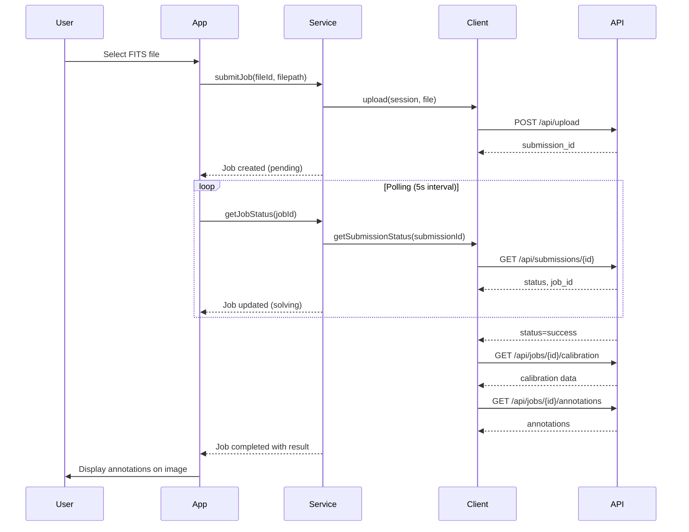

[Root](../../../CLAUDE.md) > [src](../../..) > [lib](../..) > **astrometry**

# Astrometry Module (Plate Solving)

> Astrometry.net integration for plate solving and WCS calibration

## Module Responsibility

This module provides plate solving capabilities through the Astrometry.net service:

- Submit images to Astrometry.net for plate solving
- Poll for job completion and retrieve results
- Parse calibration results (WCS solution)
- Extract celestial object annotations
- Export WCS headers for FITS files
- Sync solving results to target management

## Entry & Startup

| File                   | Purpose                                      |
| ---------------------- | -------------------------------------------- |
| `astrometryService.ts` | High-level service orchestration             |
| `astrometryClient.ts`  | Low-level API client for nova.astrometry.net |
| `types.ts`             | Type definitions for jobs and results        |
| `syncToTarget.ts`      | Sync solving results to target store         |

**Initialization:**

```typescript
import { AstrometryService } from "./astrometryService";
import { useAstrometryStore } from "../../stores/useAstrometryStore";

const service = new AstrometryService();
await service.initialize();
```

## Public Interfaces

### AstrometryService

```typescript
class AstrometryService {
  // Initialize with stored API key
  initialize(): Promise<void>;

  // Submit a FITS file for solving
  submitJob(
    fileId: string,
    filepath: string,
    options?: Partial<AstrometryUploadOptions>,
  ): Promise<AstrometryJob>;

  // Cancel a running job
  cancelJob(jobId: string): Promise<void>;

  // Get current job status
  getJobStatus(jobId: string): Promise<AstrometryJob>;

  // Get all jobs
  getJobs(): AstrometryJob[];

  // Poll job until completion
  waitForCompletion(
    jobId: string,
    onProgress?: (job: AstrometryJob) => void,
  ): Promise<AstrometryJob>;

  // Export WCS headers
  exportWCSHeaders(result: AstrometryResult): HeaderKeyword[];
}
```

### AstrometryClient

```typescript
class AstrometryClient {
  // Login and get session token
  login(apiKey: string): Promise<string>;

  // Upload file for solving
  upload(session: string, file: Blob | Buffer, options?: AstrometryUploadOptions): Promise<number>; // submission ID

  // Upload from URL
  urlUpload(session: string, url: string, options?: AstrometryUploadOptions): Promise<number>;

  // Get submission status
  getSubmissionStatus(submissionId: number): Promise<AstrometrySubmissionStatus>;

  // Get job status
  getJobStatus(jobId: number): Promise<AstrometryJobStatusResponse>;

  // Get calibration results
  getCalibration(jobId: number): Promise<AstrometryCalibrationResponse>;

  // Get annotations (celestial objects)
  getAnnotations(jobId: number): Promise<AstrometryAnnotationResponse[]>;
}
```

### useAstrometry Hook

```typescript
const {
  jobs, // Current jobs
  activeJob, // Currently running job
  submitJob, // Submit new job
  cancelJob, // Cancel running job
  getJobStatus, // Refresh job status
  clearJobs, // Clear all jobs
} = useAstrometry();
```

### Key Types

```typescript
// Job status
type AstrometryJobStatus =
  | "pending"
  | "uploading"
  | "submitted"
  | "solving"
  | "success"
  | "failure"
  | "cancelled";

// Job tracking
interface AstrometryJob {
  id: string; // Local UUID
  fileId?: string; // Associated FITS file ID
  fileName: string;
  thumbnailUri?: string;
  submissionId?: number; // Astrometry.net submission ID
  jobId?: number; // Astrometry.net job ID
  status: AstrometryJobStatus;
  progress: number; // 0-100
  error?: string;
  createdAt: number;
  updatedAt: number;
  result?: AstrometryResult;
}

// Solving result
interface AstrometryResult {
  calibration: AstrometryCalibration;
  annotations: AstrometryAnnotation[];
  tags: string[];
}

// WCS calibration
interface AstrometryCalibration {
  ra: number; // Center RA (degrees)
  dec: number; // Center Dec (degrees)
  radius: number; // Field radius (degrees)
  pixscale: number; // Pixel scale (arcsec/pixel)
  orientation: number; // Rotation angle (degrees)
  parity: number; // Parity (0=normal, 1=flipped)
  fieldWidth: number; // Field width (degrees)
  fieldHeight: number; // Field height (degrees)
}

// Celestial object annotation
interface AstrometryAnnotation {
  type: AstrometryAnnotationType;
  names: string[];
  pixelx: number;
  pixely: number;
  radius?: number;
}

type AstrometryAnnotationType = "star" | "hd" | "ngc" | "ic" | "messier" | "bright_star" | "other";

// Configuration
interface AstrometryConfig {
  apiKey: string;
  serverUrl: string;
  useCustomServer: boolean;
  maxConcurrent: number;
  autoSolve: boolean;
  defaultScaleUnits: "degwidth" | "arcminwidth" | "arcsecperpix";
  defaultScaleLower?: number;
  defaultScaleUpper?: number;
}
```

## Key Dependencies

| Package             | Usage                       |
| ------------------- | --------------------------- |
| `expo-secure-store` | Secure API key storage      |
| `expo-network`      | Network connectivity checks |

## Data Flow



## Testing & Quality

| Aspect     | Status | Files                                 |
| ---------- | ------ | ------------------------------------- |
| Unit Tests | Good   | `__tests__/astrometryClient.test.ts`  |
|            |        | `__tests__/astrometryService.test.ts` |
|            |        | `__tests__/wcsExport.test.ts`         |
|            |        | `__tests__/formatUtils.test.ts`       |
|            |        | `__tests__/syncToTarget.test.ts`      |

## FAQ

**Q: How do I submit an image for plate solving?**

```typescript
import { useAstrometry } from "../../hooks/useAstrometry";

const { submitJob } = useAstrometry();
const job = await submitJob(fileId, filepath, {
  scale_units: "arcsecperpix",
  scale_lower: 0.5,
  scale_upper: 5.0,
});
```

**Q: How do I get the solving result?**

```typescript
const { jobs } = useAstrometry();
const completedJob = jobs.find((j) => j.id === jobId && j.status === "success");
if (completedJob?.result) {
  const { calibration, annotations } = completedJob.result;
  console.log(`Center: RA ${calibration.ra}, Dec ${calibration.dec}`);
  console.log(`Pixel scale: ${calibration.pixscale} arcsec/pixel`);
}
```

**Q: How do I export WCS headers?**

```typescript
import { exportWCSHeaders } from "./wcsExport";
import { writeHeaderKeyword } from "../fits/headerWriter";

const wcsHeaders = exportWCSHeaders(result.calibration);
// Returns: [{ key: "CTYPE1", value: "RA---TAN" }, ...]
```

**Q: How do I sync results to a target?**

```typescript
import { syncToTarget } from "./syncToTarget";

// If solved image matches a target, update coordinates
await syncToTarget(fileId, result);
```

## API Constants

```typescript
const ASTROMETRY_API_PATHS = {
  login: "/api/login",
  upload: "/api/upload",
  urlUpload: "/api/url_upload",
  submissions: "/api/submissions",
  jobs: "/api/jobs",
};

const ASTROMETRY_POLL_INTERVAL = 5000; // 5 seconds
const ASTROMETRY_MAX_POLL_ATTEMPTS = 120; // 10 minutes max
const ASTROMETRY_REQUEST_TIMEOUT = 30000; // 30 seconds
const ASTROMETRY_UPLOAD_TIMEOUT = 120000; // 2 minutes
```

## Related Files

```
src/lib/astrometry/
|-- astrometryService.ts    # High-level service
|-- astrometryClient.ts     # API client
|-- types.ts                # Type definitions
|-- wcsExport.ts            # WCS header export
|-- formatUtils.ts          # Formatting utilities
|-- syncToTarget.ts         # Target sync
|-- index.ts                # Module exports
`-- __tests__/
    |-- astrometryClient.test.ts
    |-- astrometryService.test.ts
    |-- wcsExport.test.ts
    |-- formatUtils.test.ts
    `-- syncToTarget.test.ts
```

## Changelog

| Date       | Changes                          |
| ---------- | -------------------------------- |
| 2026-02-15 | AI context documentation created |
